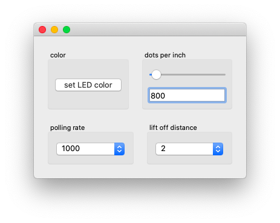

# Control Panel

A cross-platform control panel application for the Microsoft Pro IntelliMouse.



The application is build using:
* [Python 3.7](https://www.python.org/downloads/release/python-373/) (for general programming purposes)
* [cython-hidapi](https://github.com/trezor/cython-hidapi) (for the HID interactions)
* [PySide2](https://wiki.qt.io/Qt_for_Python) (for the GUI)
* [fbs](https://github.com/mherrmann/fbs) (for building and packaging)

## Features
It allows you to configure the following settings:
- [x] DPI
- [x] LOD
- [x] LED
- [x] Polling Rate

It doesn't (yet) allow you to configure the following settings:
- [ ] Custom Button Mapping
- [ ] Custom LOD Calibration

## Download
Using the control panel is simple, simply download one of the pre-built binaries and you're good to go.

* Windows
* macOS
* Debian

## Development
To set up a virtual environment to further develop this application, use the following commands:
```bash
python3 -m venv venv
source venv/bin/activate
pip3 install -r requirements.txt

# to run the application
fbs run

# to build the application
fbs freeze

# once you're done
deactivate
```

## License
This application is licensed under the the GPLv3 license, as dependencies of this project require it.

## Disclaimer
All product names, trademarks and registered trademarks are property of their respective owners. All company, product and service names used in this project are for identification purposes only. Use of these names, trademarks and brands does not imply endorsement.

Microsoft Pro IntelliMouse is a registered trademark or trademark of Microsoft Corporation in the United States and/or other countries.

All other trademarks cited herein are the property of their respective owners.

In no way is this project published by, affiliated with, or sponsorsed, or endorsed, or approved by Microsoft.
